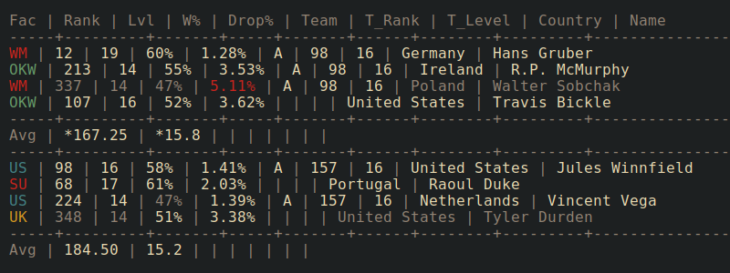

# CoH2 Live Stats

Show match stats of a currently played, replayed or last played Company of Heroes 2 match.

---



Example output on [Windows Terminal](https://github.com/microsoft/terminal)
with [gruvbox](https://github.com/morhetz/gruvbox) colors
and [Inconsolata](https://github.com/googlefonts/Inconsolata) font.

## Installation

You can either run _CoH2 Live Stats_ as a standalone bundled application or install and run it with Python.

### Run Bundle [Recommended]

1. [Download](https://github.com/brofi/coh2-live-stats/releases) latest release of _CoH2LiveStats-bundle-[version].zip_
2. Unzip and run _CoH2LiveStats.exe_


### Install from source

1. Get source code
   * [Download](https://github.com/brofi/coh2-live-stats/archive/refs/heads/master.zip) source files and unzip
   * **_or_** download and install [Git](https://git-scm.com/download/win) and run `git  clone https://github.com/brofi/coh2-live-stats.git`
2. Download and install [Python](https://www.python.org/downloads/windows/) >= 3.12
3. Run `pip install .` from project root
4. Run `python -m coh2_live_stats` or simply `coh2livestats`

### Requirements

* Microsoft Windows
* (Optional) [Windows Terminal](https://github.com/microsoft/terminal) for proper UTF-8 support

## Configuration


[//]: # (<mark_settings>)

### `[]` Root level settings

| Attribute | Description                                                                       |
|:----------|:----------------------------------------------------------------------------------|
| `logfile` | Path to observed Company of Heroes 2 log file (supports OS environment variables) |

### `[notification]` Notification sound settings

| Attribute    | Description                                                                 |
|:-------------|:----------------------------------------------------------------------------|
| `play_sound` | Play a notification sound when a new multiplayer match was found            |
| `sound`      | Built-in notification sound name or full path to custom waveform audio file |

### `[table]` Output table settings

| Attribute                   | Description                                                                                 |
|:----------------------------|:--------------------------------------------------------------------------------------------|
| `color`                     | Use color for output                                                                        |
| `border`                    | Draw a border around the output table                                                       |
| `show_average`              | Show team's average rank and level                                                          |
| `always_show_team`          | Always show team columns, even if they're empty                                             |
| `drop_ratio_high_threshold` | Drop ratios are considered high if they're higher than or equal this value (used for color) |
| `win_ratio_high_threshold`  | Win ratios are considered high if they're higher than or equal this value (used for color)  |
| `win_ratio_low_threshold`   | Win ratios are considered low if they're lower than this value (used for color)             |
| `prestige_star_char`        | Character to use for one prestige level star                                                |
| `prestige_half_star_char`   | Character to use for a half prestige level star                                             |

### `[table.colors]` Output table color settings

| Attribute | Description               |
|:----------|:--------------------------|
| `border`  | Output table border color |
| `label`   | Output table header color |

### `[table.colors.player]` Player-specific color settings

| Attribute        | Description                                        |
|:-----------------|:---------------------------------------------------|
| `high_drop_rate` | Color for a high player drop ratio                 |
| `high`           | Color for highest ranked player and high win ratio |
| `low`            | Color for lowest ranked player and low win ratio   |

### `[table.colors.faction]` Faction colors

| Attribute | Description             |
|:----------|:------------------------|
| `wm`      | Wehrmacht color         |
| `su`      | Soviet Union color      |
| `okw`     | Oberkommando West color |
| `us`      | US Forces color         |
| `uk`      | British Forces color    |

### `[table.columns]` Output table columns

| Attribute       | Description                                                                                                                            |
|:----------------|:---------------------------------------------------------------------------------------------------------------------------------------|
| `faction`       | Player faction                                                                                                                         |
| `rank`          | Leaderboard rank if the player currently has a rank or highest known rank (indicator: +) if available or estimated rank (indicator: ?) |
| `level`         | Rank level representing the leaderboard rank                                                                                           |
| `prestige`      | Experience expressed in stars                                                                                                          |
| `win_ratio`     | Percentage of games won                                                                                                                |
| `drop_ratio`    | Percentage of games dropped                                                                                                            |
| `team`          | The pre-made team the player is part of if any                                                                                         |
| `team_rank`     | The current rank of the pre-made team if any                                                                                           |
| `team_level`    | The current rank level of the pre-made team if any                                                                                     |
| `steam_profile` | Steam profile URL                                                                                                                      |
| `country`       | Player country                                                                                                                         |
| `name`          | Player name                                                                                                                            |

### For each `column` in `[table.columns]`:

| Attribute | Description                                |
|:----------|:-------------------------------------------|
| `label`   | `column` header                            |
| `visible` | Whether to show the `column`               |
| `align`   | `column` alignment                         |
| `pos`     | `column` position used for column ordering |

### Appendix

<details>
<summary>All settings</summary>

| Attribute                             | Description                                                                                                                            |
|:--------------------------------------|:---------------------------------------------------------------------------------------------------------------------------------------|
| `logfile`                             | Path to observed Company of Heroes 2 log file (supports OS environment variables)                                                      |
| `[notification]`                      | Notification sound settings                                                                                                            |
| `notification.play_sound`             | Play a notification sound when a new multiplayer match was found                                                                       |
| `notification.sound`                  | Built-in notification sound name or full path to custom waveform audio file                                                            |
| `[table]`                             | Output table settings                                                                                                                  |
| `table.color`                         | Use color for output                                                                                                                   |
| `table.border`                        | Draw a border around the output table                                                                                                  |
| `table.show_average`                  | Show team's average rank and level                                                                                                     |
| `table.always_show_team`              | Always show team columns, even if they're empty                                                                                        |
| `table.drop_ratio_high_threshold`     | Drop ratios are considered high if they're higher than or equal this value (used for color)                                            |
| `table.win_ratio_high_threshold`      | Win ratios are considered high if they're higher than or equal this value (used for color)                                             |
| `table.win_ratio_low_threshold`       | Win ratios are considered low if they're lower than this value (used for color)                                                        |
| `table.prestige_star_char`            | Character to use for one prestige level star                                                                                           |
| `table.prestige_half_star_char`       | Character to use for a half prestige level star                                                                                        |
| `[table.colors]`                      | Output table color settings                                                                                                            |
| `table.colors.border`                 | Output table border color                                                                                                              |
| `table.colors.label`                  | Output table header color                                                                                                              |
| `[table.colors.player]`               | Player-specific color settings                                                                                                         |
| `table.colors.player.high_drop_rate`  | Color for a high player drop ratio                                                                                                     |
| `table.colors.player.high`            | Color for highest ranked player and high win ratio                                                                                     |
| `table.colors.player.low`             | Color for lowest ranked player and low win ratio                                                                                       |
| `[table.colors.faction]`              | Faction colors                                                                                                                         |
| `table.colors.faction.wm`             | Wehrmacht color                                                                                                                        |
| `table.colors.faction.su`             | Soviet Union color                                                                                                                     |
| `table.colors.faction.okw`            | Oberkommando West color                                                                                                                |
| `table.colors.faction.us`             | US Forces color                                                                                                                        |
| `table.colors.faction.uk`             | British Forces color                                                                                                                   |
| `[table.columns]`                     | Output table columns                                                                                                                   |
| `[table.columns.faction]`             | Player faction                                                                                                                         |
| `table.columns.faction.label`         | `faction` header                                                                                                                       |
| `table.columns.faction.visible`       | Whether to show the `faction`                                                                                                          |
| `table.columns.faction.align`         | `faction` alignment                                                                                                                    |
| `table.columns.faction.pos`           | `faction` position used for column ordering                                                                                            |
| `[table.columns.rank]`                | Leaderboard rank if the player currently has a rank or highest known rank (indicator: +) if available or estimated rank (indicator: ?) |
| `table.columns.rank.label`            | `rank` header                                                                                                                          |
| `table.columns.rank.visible`          | Whether to show the `rank`                                                                                                             |
| `table.columns.rank.align`            | `rank` alignment                                                                                                                       |
| `table.columns.rank.pos`              | `rank` position used for column ordering                                                                                               |
| `[table.columns.level]`               | Rank level representing the leaderboard rank                                                                                           |
| `table.columns.level.label`           | `level` header                                                                                                                         |
| `table.columns.level.visible`         | Whether to show the `level`                                                                                                            |
| `table.columns.level.align`           | `level` alignment                                                                                                                      |
| `table.columns.level.pos`             | `level` position used for column ordering                                                                                              |
| `[table.columns.prestige]`            | Experience expressed in stars                                                                                                          |
| `table.columns.prestige.label`        | `prestige` header                                                                                                                      |
| `table.columns.prestige.visible`      | Whether to show the `prestige`                                                                                                         |
| `table.columns.prestige.align`        | `prestige` alignment                                                                                                                   |
| `table.columns.prestige.pos`          | `prestige` position used for column ordering                                                                                           |
| `[table.columns.win_ratio]`           | Percentage of games won                                                                                                                |
| `table.columns.win_ratio.label`       | `win_ratio` header                                                                                                                     |
| `table.columns.win_ratio.visible`     | Whether to show the `win_ratio`                                                                                                        |
| `table.columns.win_ratio.align`       | `win_ratio` alignment                                                                                                                  |
| `table.columns.win_ratio.pos`         | `win_ratio` position used for column ordering                                                                                          |
| `[table.columns.drop_ratio]`          | Percentage of games dropped                                                                                                            |
| `table.columns.drop_ratio.label`      | `drop_ratio` header                                                                                                                    |
| `table.columns.drop_ratio.visible`    | Whether to show the `drop_ratio`                                                                                                       |
| `table.columns.drop_ratio.align`      | `drop_ratio` alignment                                                                                                                 |
| `table.columns.drop_ratio.pos`        | `drop_ratio` position used for column ordering                                                                                         |
| `[table.columns.team]`                | The pre-made team the player is part of if any                                                                                         |
| `table.columns.team.label`            | `team` header                                                                                                                          |
| `table.columns.team.visible`          | Whether to show the `team`                                                                                                             |
| `table.columns.team.align`            | `team` alignment                                                                                                                       |
| `table.columns.team.pos`              | `team` position used for column ordering                                                                                               |
| `[table.columns.team_rank]`           | The current rank of the pre-made team if any                                                                                           |
| `table.columns.team_rank.label`       | `team_rank` header                                                                                                                     |
| `table.columns.team_rank.visible`     | Whether to show the `team_rank`                                                                                                        |
| `table.columns.team_rank.align`       | `team_rank` alignment                                                                                                                  |
| `table.columns.team_rank.pos`         | `team_rank` position used for column ordering                                                                                          |
| `[table.columns.team_level]`          | The current rank level of the pre-made team if any                                                                                     |
| `table.columns.team_level.label`      | `team_level` header                                                                                                                    |
| `table.columns.team_level.visible`    | Whether to show the `team_level`                                                                                                       |
| `table.columns.team_level.align`      | `team_level` alignment                                                                                                                 |
| `table.columns.team_level.pos`        | `team_level` position used for column ordering                                                                                         |
| `[table.columns.steam_profile]`       | Steam profile URL                                                                                                                      |
| `table.columns.steam_profile.label`   | `steam_profile` header                                                                                                                 |
| `table.columns.steam_profile.visible` | Whether to show the `steam_profile`                                                                                                    |
| `table.columns.steam_profile.align`   | `steam_profile` alignment                                                                                                              |
| `table.columns.steam_profile.pos`     | `steam_profile` position used for column ordering                                                                                      |
| `[table.columns.country]`             | Player country                                                                                                                         |
| `table.columns.country.label`         | `country` header                                                                                                                       |
| `table.columns.country.visible`       | Whether to show the `country`                                                                                                          |
| `table.columns.country.align`         | `country` alignment                                                                                                                    |
| `table.columns.country.pos`           | `country` position used for column ordering                                                                                            |
| `[table.columns.name]`                | Player name                                                                                                                            |
| `table.columns.name.label`            | `name` header                                                                                                                          |
| `table.columns.name.visible`          | Whether to show the `name`                                                                                                             |
| `table.columns.name.align`            | `name` alignment                                                                                                                       |
| `table.columns.name.pos`              | `name` position used for column ordering                                                                                               |

</details>

[//]: # (</mark_settings>)

### Example Configurations

[//]: # (<mark_examples>)


[//]: # (</mark_examples>)

## Development

### Setup

* Create and activate virtual environment:
```console
$  python -m venv venv
$ .\venv\Scripts\Activate.ps1
```

* Install project with development dependencies in editable mode:
```console
$ pip install invoke
$ inv install --dev
```

* Install `pre-commit` hooks:
```console
$ pre-commit install
```

### Build

* Build with `setuptools` and `build` and create a `PyInstaller` bundle:
```console
$ inv build
```
* Distribution bundle: `.\dist\CoH2LiveStats-bundle-{version}.zip`
* See `inv -l` and `inv [task] -h` for more information on available `invoke` tasks
